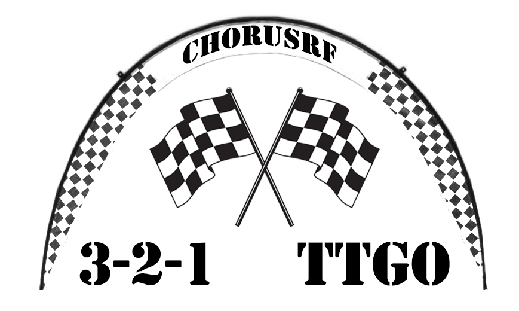
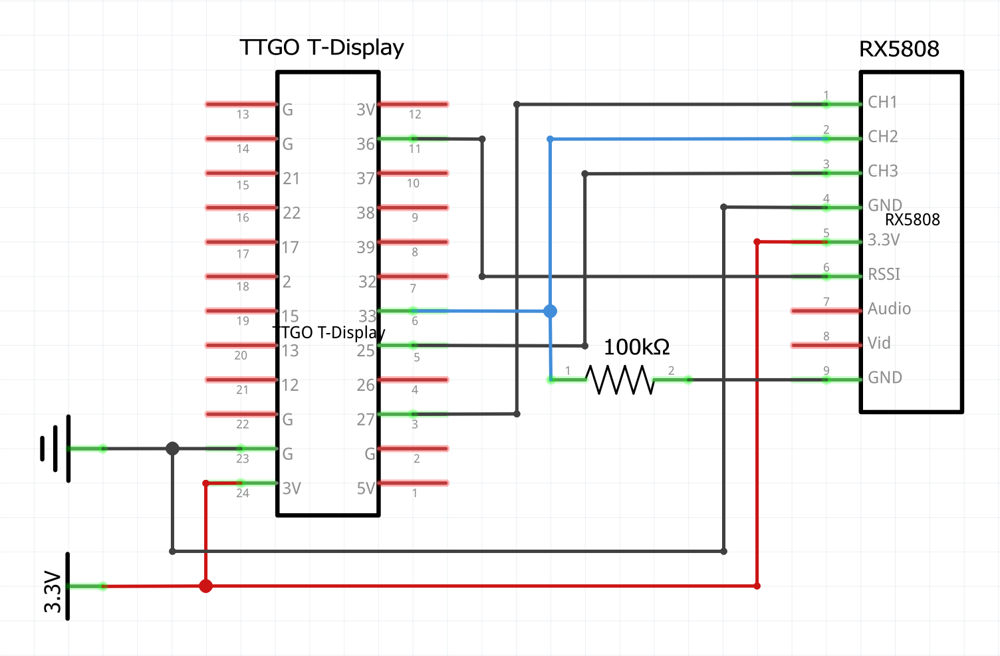

# NOT WORKING!!!

# TTGO-T-RaceTimer 

This is an attempt to make AlessandroAU/Chorus32-ESP32LapTimer (https://github.com/AlessandroAU/Chorus32-ESP32LapTimer) work on a 
TTGO T-Display and add/change some things.

## Connections TTGO T-Display --> RX5808

- TTGO 3V       -->     RX5808 3.3V/5V (RX5808 works fine on 3.3V)
- TTGO G        -->     RX5808 GND
- TTGO 27       -->     RX5808 CH1
- TTGO 25       -->     RX5808 CH3
- TTGO 33       -->     RX5808 CH2 (100K resistor between CH2 and Ground to make switching band/chanel stable)
- TTGO 36       -->     RX5808 RSSI

## Things to do

- TTGO T-Display support
- Color TFT support
- Make solo pilot version (like original Chorus RF(https://github.com/voroshkov/Chorus-RF-Laptimer))
- Link multiple solo timers to do a multi pilot race
- Design PCB for solo linkable timer
